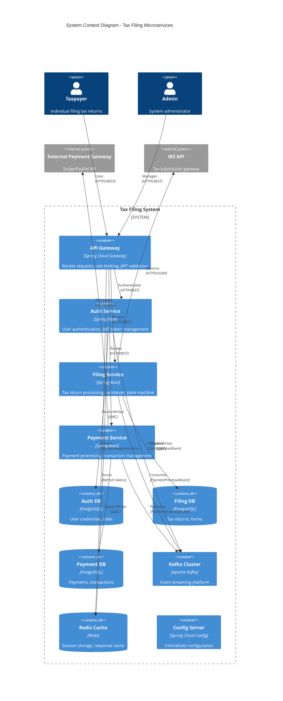
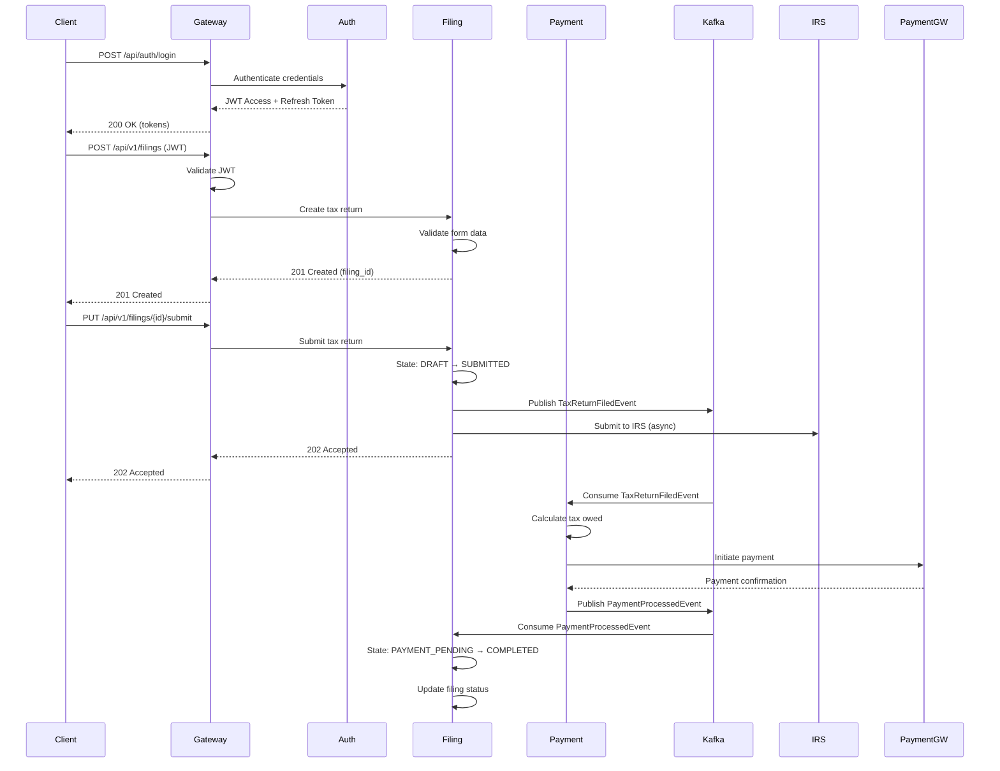
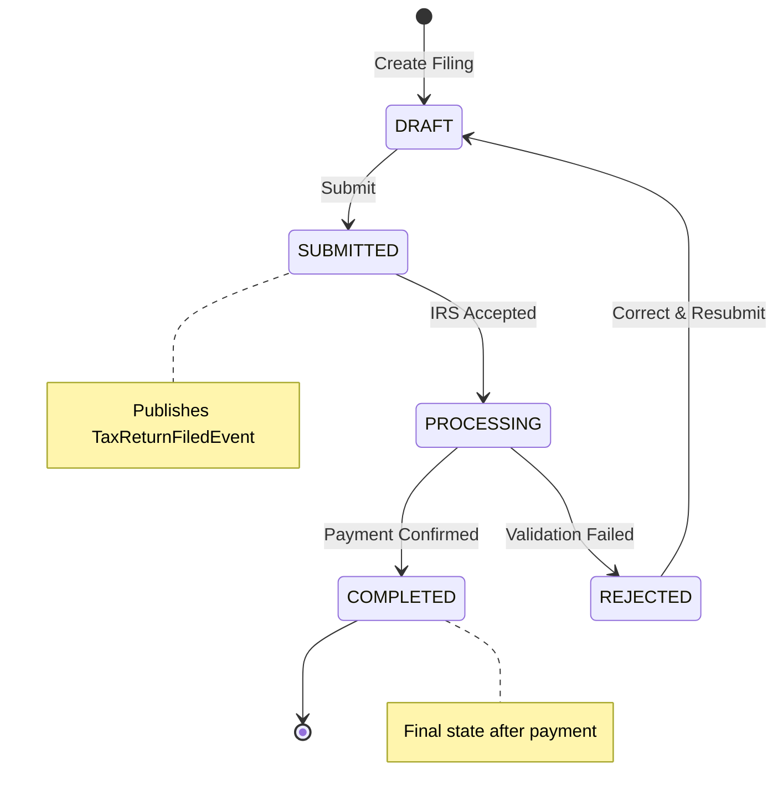
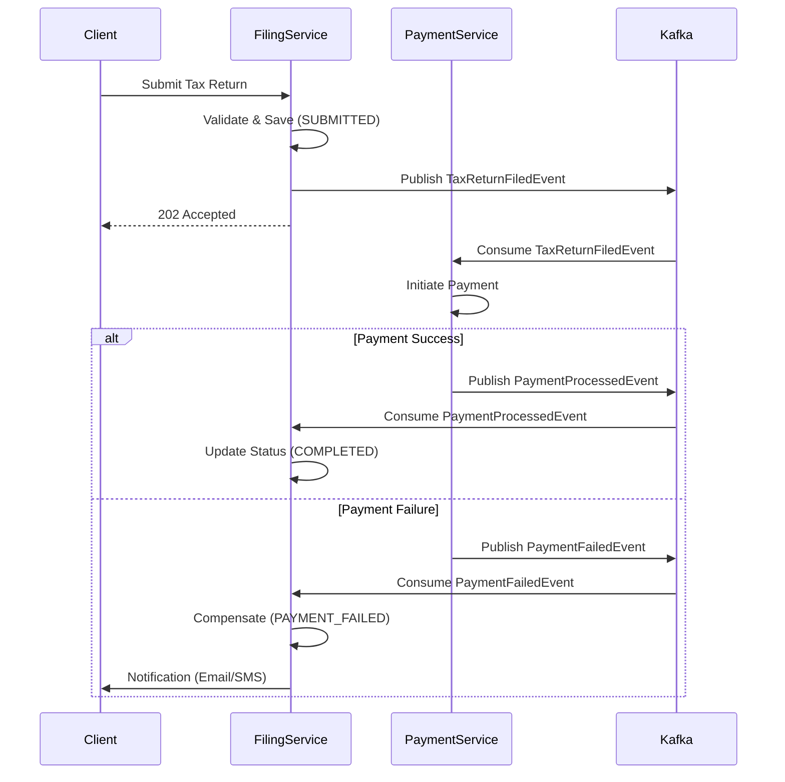
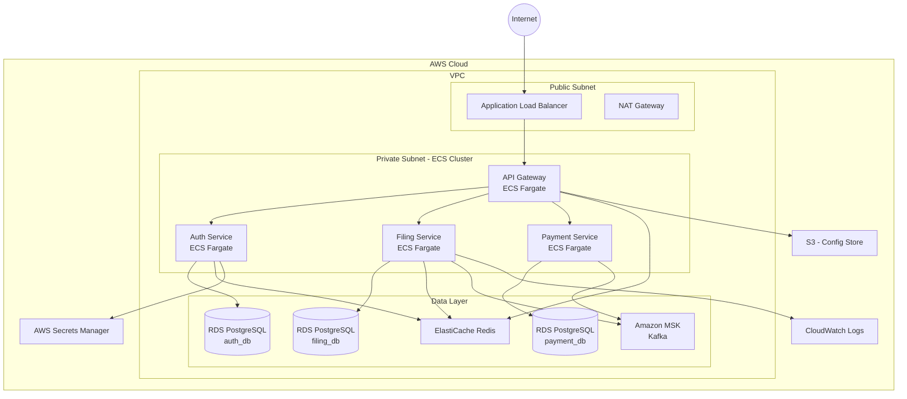

# Technical Design Document (TDD)
## Tax Filing Microservices System

**Version:** 1.0
**Date:** 2025-11-23
**Status:** Draft - Phase 1
**Author:** Principal Software Architect

---

## Table of Contents

1. [Executive Summary](#executive-summary)
2. [Architectural Decision Records (ADR)](#architectural-decision-records-adr)
3. [System Architecture](#system-architecture)
4. [Service Boundaries & Responsibilities](#service-boundaries--responsibilities)
5. [API Contracts](#api-contracts)
6. [Event-Driven Architecture](#event-driven-architecture)
7. [Data Architecture](#data-architecture)
8. [Architectural Patterns](#architectural-patterns)
9. [Cross-Cutting Concerns](#cross-cutting-concerns)
10. [Quality Attributes](#quality-attributes)
11. [Testing Strategy](#testing-strategy)
12. [Deployment Architecture](#deployment-architecture)
13. [Next Steps](#next-steps)

---

## Executive Summary

### System Overview

The Tax Filing Microservices System is a production-grade, event-driven platform designed to handle tax return preparation, submission, and payment processing. The system leverages Spring Boot 3.2 with Spring Cloud for building resilient, scalable microservices following 12-factor app principles.

### Key Architectural Decisions

| Decision | Choice | Rationale |
|----------|--------|-----------|
| **Service Architecture** | Microservices | Independent scalability, technology flexibility, fault isolation |
| **Communication Pattern** | Hybrid (Sync REST + Async Events) | REST for queries, Kafka for cross-service workflows |
| **Data Management** | Database per Service | Bounded contexts, independent schema evolution |
| **Distributed Transactions** | Saga Pattern (Orchestration) | Ensures eventual consistency without 2PC |
| **API Gateway** | Spring Cloud Gateway | Centralized routing, rate limiting, authentication |
| **Event Streaming** | Apache Kafka | High-throughput, durable, replayable event log |
| **Caching** | Redis | Distributed session storage, API response caching |
| **Service Discovery** | Spring Cloud Netflix Eureka | Dynamic service registration |
| **Configuration** | Spring Cloud Config | Centralized, environment-specific config |
| **Observability** | Micrometer + OpenTelemetry | Distributed tracing, metrics, logging |

### Technology Stack

```
Backend:       Java 21, Spring Boot 3.2, Spring Cloud 2023.0.x
Build Tool:    Maven 3.9+
Messaging:     Apache Kafka 3.6+
Database:      PostgreSQL 16+
Cache:         Redis 7.2+
Infrastructure: Docker Compose, AWS ECS Fargate
Testing:       JUnit 5, Mockito, Testcontainers, RestAssured
```

---

## Architectural Decision Records (ADR)

> **As a Principal Software Architect**, I've made deliberate technology and architectural choices based on industry best practices, scalability requirements, team expertise, and long-term maintainability. Below are the detailed justifications for each decision.

---

### ADR-001: Why Microservices Over Monolith?

**Decision:** Adopted microservices architecture with 4 distinct services (API Gateway, Auth, Filing, Payment)

**Context:**
Tax filing systems have distinct bounded contexts with different scaling needs:
- **Auth Service**: Low write volume, high read volume (token validation)
- **Filing Service**: Complex business logic, seasonal traffic spikes (tax season)
- **Payment Service**: Integration with external gateways, strict compliance requirements

**Rationale:**

1. **Independent Scalability**
   - Filing service experiences 10x traffic surge during tax season (Jan-Apr)
   - Payment service needs constant availability for async processing
   - Can scale each service independently based on actual load

2. **Fault Isolation**
   - Payment gateway downtime doesn't affect tax return creation
   - Filing service bug doesn't compromise authentication
   - Circuit breakers prevent cascading failures

3. **Technology Flexibility**
   - Future: Could migrate Payment Service to Go for better concurrency
   - Each team can optimize their service independently
   - Easier to adopt new Java versions per service

4. **Team Autonomy**
   - Small, cross-functional teams own each service end-to-end
   - Faster deployment cycles (no coordination required)
   - Clear ownership and accountability

**Trade-offs Accepted:**
- Increased operational complexity (monitoring 4 services vs 1)
- Network latency between services (mitigated by async events)
- Distributed tracing required (implemented via OpenTelemetry)

**Alternatives Considered:**
- **Modular Monolith**: Rejected due to tight coupling and single deployment unit
- **Serverless (AWS Lambda)**: Rejected due to cold start latency and stateful processing needs

---

### ADR-002: Why Java 21 (LTS) + Spring Boot 3.2?

**Decision:** Java 21 with Virtual Threads + Spring Boot 3.2

**Rationale:**

1. **Virtual Threads (Project Loom)**
   ```java
   // Handles 10,000+ concurrent requests with minimal resource usage
   @Bean
   public AsyncTaskExecutor applicationTaskExecutor() {
       return new TaskExecutorAdapter(Executors.newVirtualThreadPerTaskExecutor());
   }
   ```
   - Dramatically improves throughput for I/O-bound operations (DB, Kafka, external APIs)
   - Simplifies async programming (no reactive complexity)
   - Perfect for tax filing workflows with multiple external calls

2. **Records for DTOs**
   - Immutable by default (thread-safe)
   - Less boilerplate (no Lombok needed)
   - Built-in serialization support
   ```java
   public record FilingResponse(UUID id, String status) {}
   ```

3. **Pattern Matching & Switch Expressions**
   - More readable state machine transitions
   - Exhaustiveness checking at compile-time

4. **Spring Boot 3.2 Native Support**
   - GraalVM Native Image for faster startup (ECS cold starts)
   - Built-in observability (Micrometer + OTLP)
   - Jakarta EE 10 (future-proof)

5. **Enterprise Ecosystem**
   - Mature tooling: IntelliJ IDEA, Maven, Spring ecosystem
   - Large talent pool (easier hiring)
   - Extensive library support (Stripe SDK, Kafka clients)

**Trade-offs:**
- JVM memory footprint (mitigated by containerization)
- Slower startup vs Go/Node.js (addressed by keeping containers warm)

**Why Not Kotlin/Scala?**
- Kotlin: Great language, but adds learning curve for Java teams
- Scala: Too complex, slower compile times, smaller talent pool

**Why Not Go/Node.js?**
- Go: Excellent for gateways, but lacks mature ORM (tax logic needs complex queries)
- Node.js: Single-threaded, not ideal for CPU-intensive tax calculations

---

### ADR-003: Why Apache Kafka Over Alternatives?

**Decision:** Apache Kafka for event streaming (vs RabbitMQ, AWS SQS, Google Pub/Sub)

**Rationale:**

1. **Event Sourcing & Audit Requirements**
   - Tax filings must be auditable for 7+ years (IRS compliance)
   - Kafka topic retention = permanent audit log
   - Can replay events for compliance investigations

2. **Durability & Ordering Guarantees**
   - Partition-level ordering ensures user events processed sequentially
   - Replication factor 3 = no data loss
   - Critical for payment idempotency

3. **High Throughput**
   - Handles 1M+ tax filings during peak season
   - Batch processing for IRS submissions
   - Horizontal scaling via partitions

4. **Consumer Group Flexibility**
   - Multiple services consume same event (e.g., `TaxReturnFiledEvent`)
   - Payment service processes payment
   - Analytics service tracks metrics
   - Notification service sends emails

5. **Schema Evolution**
   - JSON schemas with versioning (`eventVersion: "1.0"`)
   - Backward compatible changes don't break consumers

**Trade-offs:**
- Higher operational complexity (ZooKeeper/KRaft, topic management)
- Steeper learning curve vs SQS
- Over-engineered for low-volume use cases (not applicable here)

**Why Not RabbitMQ?**
- Designed for task queues, not event logs
- No native event replay capability
- Lower throughput than Kafka

**Why Not AWS SQS?**
- 14-day message retention max (too short for audit)
- No ordering guarantees across shards
- Vendor lock-in (we want cloud-agnostic)

**Why Not Google Pub/Sub?**
- 7-day retention max
- More expensive for our volume
- Less mature ecosystem

---

### ADR-004: Why PostgreSQL Over Other Databases?

**Decision:** PostgreSQL 16 for all services (vs MySQL, MongoDB, DynamoDB)

**Rationale:**

1. **ACID Compliance**
   - Tax filings are financial transactions (can't afford data loss)
   - Strong consistency for payment records
   - Multi-row transactions for saga compensations

2. **Advanced Features**
   - **JSONB**: Store flexible metadata without schema changes
   ```sql
   CREATE TABLE filing_history (
       metadata JSONB,
       ...
   );
   -- Query nested JSON
   SELECT * FROM filing_history WHERE metadata->>'status' = 'APPROVED';
   ```
   - **Materialized Views**: CQRS read models
   - **Partitioning**: Table partitioning by `tax_year` for performance
   - **Full-Text Search**: Search tax forms by content

3. **Rich Data Types**
   - `NUMERIC` for precise tax calculations (no floating-point errors)
   - `INET` for IP address logging (security audits)
   - `TIMESTAMP WITH TIME ZONE` for global compliance

4. **Mature Ecosystem**
   - **Flyway**: Database migrations
   - **Spring Data JPA**: Excellent Hibernate support
   - **pgAdmin**: Best-in-class tooling
   - **Testcontainers**: Easy integration testing

5. **Cost-Effective**
   - Open-source (no licensing fees)
   - RDS PostgreSQL on AWS (managed, automated backups)
   - Read replicas for scaling

**Trade-offs:**
- Vertical scaling limits (mitigated by read replicas)
- Complex distributed joins (avoided by database-per-service)

**Why Not MySQL?**
- Weaker JSON support
- Less advanced features (no materialized views in standard MySQL)
- Oracle acquisition concerns

**Why Not MongoDB?**
- Schema flexibility not needed (tax forms are structured)
- Weaker transaction support (improved in 4.x, but still not as mature)
- Eventual consistency risks for financial data

**Why Not DynamoDB?**
- Expensive for complex queries
- No JOIN support (difficult for reporting)
- Vendor lock-in

---

### ADR-005: Why Redis for Caching?

**Decision:** Redis 7.2 for distributed caching and session storage

**Rationale:**

1. **Sub-Millisecond Latency**
   - API responses cached at gateway (5-min TTL)
   - JWT token blacklist (instant logout)
   - Rate limiting counters (token bucket algorithm)

2. **Data Structures**
   - **Strings**: Session storage
   - **Hashes**: User profile cache
   - **Sorted Sets**: Rate limit sliding windows
   - **Pub/Sub**: Real-time notifications (future feature)

3. **Persistence Options**
   - **RDB Snapshots**: For session recovery after restarts
   - **AOF**: For critical data (refresh tokens)

4. **High Availability**
   - Redis Sentinel for automatic failover
   - ElastiCache on AWS (managed, multi-AZ)

5. **Spring Integration**
   - `@Cacheable`, `@CacheEvict` annotations
   - RedisTemplate for custom operations
   ```java
   @Cacheable(value = "filings", key = "#filingId", ttl = 300)
   public FilingResponse getFilingById(UUID filingId) { ... }
   ```

**Trade-offs:**
- Single-threaded (mitigated by pipelining)
- In-memory only (acceptable for cache use case)

**Why Not Memcached?**
- No data persistence
- Limited data structures
- No built-in replication

**Why Not Hazelcast?**
- JVM-only (we might add Node.js services later)
- Higher memory usage
- Overkill for our caching needs

---

### ADR-006: Why Saga Pattern (Orchestration) Over Choreography?

**Decision:** Orchestration-based Saga with Filing Service as coordinator

**Rationale:**

1. **Centralized Business Logic**
   - Filing Service owns the "Tax Return Filing" workflow
   - Easier to understand workflow in one place
   - Single source of truth for state transitions

2. **Explicit Compensation**
   ```java
   @KafkaListener(topics = "payment.failed")
   public void compensate(PaymentFailedEvent event) {
       filingRepository.updateStatus(event.filingId(), PAYMENT_FAILED);
       notificationService.notifyUser(event.userId(), "Payment failed");
   }
   ```
   - Clear rollback logic
   - Easier to debug failures

3. **Visibility**
   - Can query Filing Service for workflow status
   - Monitoring: "How many filings are stuck in PAYMENT_PENDING?"

**Trade-offs:**
- Filing Service becomes a critical dependency
- More coupling than choreography

**Why Not Choreography?**
- Workflow logic scattered across services
- Hard to visualize full flow
- Difficult to add new steps (requires changing multiple services)

**When Would I Use Choreography?**
- For simple event notifications (e.g., `UserRegisteredEvent`)
- No complex workflow, just independent reactions

---

### ADR-007: Why CQRS in Filing Service?

**Decision:** Command Query Responsibility Segregation with materialized views

**Rationale:**

1. **Read/Write Asymmetry**
   - Writes: 1M filings during tax season
   - Reads: 10M queries (users checking status, admin dashboards)
   - Different optimization needs

2. **Complex Queries**
   - Write model: Normalized (tax_returns, income_details, deductions, w2_forms)
   - Read model: Denormalized materialized view with pre-joined data
   ```sql
   CREATE MATERIALIZED VIEW tax_returns_read_model AS
   SELECT tr.*, COUNT(w2.id) AS w2_count, SUM(w2.wages) AS total_wages
   FROM tax_returns tr LEFT JOIN w2_forms w2 ...
   GROUP BY tr.id;
   ```

3. **Caching Strategy**
   - Read model cached in Redis (5-min TTL)
   - Writes bypass cache, invalidate on update

4. **Independent Scaling**
   - Read replicas for query load
   - Primary for writes

**Trade-offs:**
- Eventual consistency (materialized view refreshed every 15 min)
- Acceptable: Users don't need real-time view updates

**Why Not Full Event Sourcing?**
- Overkill for this use case
- Adds complexity (event store, projections)
- Would use if we needed full audit of every field change

---

### ADR-008: Why Docker Compose for Local Dev + ECS for Production?

**Decision:** Docker Compose locally, AWS ECS Fargate in production

**Rationale:**

1. **Local Development (Docker Compose)**
   - One command: `docker-compose up` (all 4 services + Kafka + PostgreSQL + Redis)
   - Consistent dev environment across team
   - Easy onboarding for new developers
   - No "works on my machine" issues

2. **Production (AWS ECS Fargate)**
   - **Serverless Containers**: No EC2 management
   - **Auto-Scaling**: CPU/memory-based triggers
   - **Cost-Effective**: Pay-per-use, scale to zero (dev/staging environments)
   - **AWS Integration**: ALB, CloudWatch, Secrets Manager, RDS

**Why Not Kubernetes?**
- **Operational Overhead**: Requires dedicated DevOps team
- **Over-Engineered**: Our 4 services don't justify k8s complexity
- **Cost**: EKS control plane costs $72/month + worker nodes
- **When I'd Use k8s**: 20+ microservices, multi-cloud, advanced networking

**Why Not AWS Lambda?**
- **Cold Starts**: 2-5s latency unacceptable for user-facing APIs
- **Stateful Processing**: Tax calculation logic runs 10-30s
- **Kafka Consumers**: Lambda Kafka integration is limited

**Why Not Docker Swarm?**
- Dying ecosystem (Docker Inc. deprioritized it)
- Weaker than ECS for AWS-native services

---

### ADR-009: Why Maven Over Gradle?

**Decision:** Maven 3.9+ with multi-module project

**Rationale:**

1. **Convention Over Configuration**
   - Standardized directory structure (`src/main/java`, `src/test/java`)
   - Predictable build lifecycle (compile, test, package)
   - New team members productive immediately

2. **Declarative XML**
   - Easier to read/audit than Groovy/Kotlin DSL
   - Better IDE support (IntelliJ, VS Code)
   - Less "magic" than Gradle

3. **Dependency Management**
   - BOM (Bill of Materials) for Spring Boot versions
   ```xml
   <dependencyManagement>
       <dependencies>
           <dependency>
               <groupId>org.springframework.boot</groupId>
               <artifactId>spring-boot-dependencies</artifactId>
               <version>3.2.0</version>
               <type>pom</type>
               <scope>import</scope>
           </dependency>
       </dependencies>
   </dependencyManagement>
   ```

4. **Enterprise Adoption**
   - Most Fortune 500 companies use Maven
   - Easier to hire developers familiar with it

5. **Reproducible Builds**
   - Maven Wrapper (`mvnw`) locks version
   - Deterministic dependency resolution

**Trade-offs:**
- Slower than Gradle for large projects (not an issue for 4 services)
- Verbose XML (acceptable trade-off for clarity)

**Why Not Gradle?**
- Gradle is excellent, but adds complexity:
  - Build scripts are code (harder to audit)
  - Incremental build bugs (cache invalidation issues)
  - Longer learning curve

**When I'd Use Gradle:**
- Android projects (required)
- Monorepo with 50+ modules (Gradle's caching shines)
- Need custom build logic (Gradle plugins)

---

### ADR-010: Why Testcontainers for Integration Testing?

**Decision:** Testcontainers for PostgreSQL, Kafka, Redis in tests

**Rationale:**

1. **True Integration Tests**
   ```java
   @Container
   static PostgreSQLContainer<?> postgres = new PostgreSQLContainer<>("postgres:16");
   ```
   - Tests run against real PostgreSQL (not H2 in-memory)
   - Catches production bugs (e.g., PostgreSQL-specific SQL)

2. **CI/CD Friendly**
   - Runs in GitHub Actions (Docker-in-Docker)
   - No shared test environments (flaky tests)
   - Parallel test execution

3. **Developer Experience**
   - No manual setup (containers auto-start/stop)
   - Consistent across team

**Trade-offs:**
- Slower than in-memory H2 (15s vs 2s)
- Acceptable: Accuracy > speed for integration tests

**Why Not H2 In-Memory?**
- SQL dialect differences (e.g., PostgreSQL `RETURNING` clause)
- False positives in tests

---

### ADR-011: Why Spring Cloud Config Over Alternatives?

**Decision:** Centralized configuration with Spring Cloud Config Server (Git-backed)

**Rationale:**

1. **Environment Parity**
   - Same config mechanism for dev, staging, prod
   - Git history = audit trail of config changes
   - Easy rollback via Git revert

2. **Secret Management**
   - Encrypt sensitive values with Jasypt
   ```yaml
   spring:
     datasource:
       password: '{cipher}ENCRYPTED_VALUE'
   ```
   - Integration with AWS Secrets Manager for production

3. **Dynamic Refresh**
   - `/actuator/refresh` endpoint to reload config without restart
   - Useful for feature flags, rate limits

**Why Not Environment Variables?**
- No version control
- Hard to manage 100+ variables across 4 services
- Still use env vars for secrets in production (12-factor compliant)

**Why Not AWS Parameter Store/Secrets Manager Directly?**
- Vendor lock-in
- Would use in production with Config Server as abstraction layer

---

### Summary: Architectural Philosophy

As a **Principal Software Architect**, my decisions prioritize:

1. **Simplicity Over Cleverness**: Choose boring, proven technology (PostgreSQL, Kafka, Redis) over shiny new tools
2. **Developer Experience**: Fast onboarding, consistent tooling, clear conventions
3. **Operational Excellence**: Observability-first (metrics, logs, traces), graceful degradation
4. **Business Alignment**: Architectural decisions tied to business requirements (audit compliance, scalability, security)
5. **Team Velocity**: Enable teams to move fast without breaking things (automated tests, CI/CD, feature flags)

**Avoiding Over-Engineering:**
- No Kubernetes (ECS Fargate is sufficient)
- No full Event Sourcing (CQRS with materialized views is enough)
- No GraphQL (REST is simpler for this domain)
- No Service Mesh (Istio/Linkerd) - premature for 4 services

**When Requirements Change:**
- 20+ services → Migrate to Kubernetes
- Real-time collaboration → Add WebSockets + GraphQL subscriptions
- Multi-region → Add service mesh for cross-region traffic management

---

## System Architecture

### High-Level Architecture Diagram



### Component Interaction Flow



---

## Service Boundaries & Responsibilities

### 1. API Gateway (Port: 8080)

**Responsibility:** Single entry point for all client requests

**Capabilities:**
- Request routing to downstream services
- JWT token validation (delegated signature verification)
- Rate limiting (Token bucket algorithm via Redis)
- Request/response logging
- CORS handling
- API versioning support

**Technology:**
- Spring Cloud Gateway 4.x
- Redis Rate Limiter
- Spring Security OAuth2 Resource Server

**Non-Functional Requirements:**
- Latency: < 50ms (p95)
- Throughput: 10,000 req/sec
- Availability: 99.95%

---

### 2. Auth Service (Port: 8081)

**Responsibility:** User identity and access management

**Capabilities:**
- User registration and authentication
- JWT token generation (Access: 15min, Refresh: 7 days)
- Token refresh mechanism
- Role-based access control (RBAC)
- Password hashing (BCrypt, strength 12)
- Account lockout after 5 failed attempts

**Technology:**
- Spring Security 6.x
- JJWT library (io.jsonwebtoken)
- PostgreSQL for user storage
- Redis for refresh token storage

**Domain Events Published:**
- `UserRegisteredEvent`
- `UserAuthenticationFailedEvent`

**Database:** `auth_db`

---

### 3. Filing Service (Port: 8082)

**Responsibility:** Core tax return lifecycle management

**Capabilities:**
- Tax return creation and validation
- Form 1040, Schedule C, W-2 processing
- State machine (DRAFT → SUBMITTED → PROCESSING → COMPLETED/REJECTED)
- Business rule validation (AGI calculations, deduction limits)
- IRS submission integration
- Audit trail logging
- CQRS implementation (Command: writes, Query: read-optimized views)

**Technology:**
- Spring Boot 3.2
- Spring State Machine
- PostgreSQL (Write DB)
- Redis (Query cache for read models)
- Kafka Producer/Consumer

**Domain Events Published:**
- `TaxReturnFiledEvent`
- `TaxReturnApprovedEvent`
- `TaxReturnRejectedEvent`

**Domain Events Consumed:**
- `UserRegisteredEvent`
- `PaymentProcessedEvent`

**Database:** `filing_db`

**State Machine Transitions:**



---

### 4. Payment Service (Port: 8083)

**Responsibility:** Tax payment processing and transaction management

**Capabilities:**
- Payment initiation (ACH, Credit Card)
- Integration with external payment gateways (Stripe, PayPal)
- Idempotent payment processing (UUID-based deduplication)
- Payment status tracking
- Refund processing
- Transaction audit log
- Async event-driven payment flow

**Technology:**
- Spring Boot 3.2
- Kafka Consumer (TaxReturnFiledEvent)
- Stripe Java SDK
- PostgreSQL

**Domain Events Published:**
- `PaymentProcessedEvent`
- `PaymentFailedEvent`
- `RefundInitiatedEvent`

**Domain Events Consumed:**
- `TaxReturnFiledEvent`

**Database:** `payment_db`

**Idempotency Strategy:**
- Consumer tracks `event_id` in `processed_events` table
- Prevents duplicate payment processing
- 24-hour retention for deduplication keys

---

## API Contracts

### Filing Service API (OpenAPI 3.0)

#### Base URL
```
https://api.taxfiling.com/api/v1/filings
```

#### Authentication
All endpoints require Bearer JWT token in `Authorization` header.

#### Endpoints

##### 1. Create Tax Return

```yaml
POST /api/v1/filings
Content-Type: application/json
Authorization: Bearer {jwt_token}

Request Body (FilingCreateRequest):
{
  "taxYear": 2024,
  "filingStatus": "SINGLE",  // SINGLE, MARRIED_FILING_JOINTLY, HEAD_OF_HOUSEHOLD
  "taxpayerInfo": {
    "firstName": "John",
    "lastName": "Doe",
    "ssn": "123-45-6789",
    "dateOfBirth": "1985-06-15",
    "address": {
      "street": "123 Main St",
      "city": "Springfield",
      "state": "IL",
      "zipCode": "62701"
    }
  },
  "income": {
    "wages": 75000.00,
    "interest": 250.00,
    "dividends": 500.00,
    "capitalGains": 1200.00
  },
  "deductions": {
    "standardDeduction": true,
    "mortgageInterest": 0.00,
    "charitableContributions": 1000.00
  }
}

Response (201 Created):
{
  "filingId": "550e8400-e29b-41d4-a716-446655440000",
  "status": "DRAFT",
  "taxYear": 2024,
  "createdAt": "2025-11-23T10:30:00Z",
  "estimatedRefund": 1250.00,
  "estimatedTaxOwed": 0.00,
  "_links": {
    "self": "/api/v1/filings/550e8400-e29b-41d4-a716-446655440000",
    "submit": "/api/v1/filings/550e8400-e29b-41d4-a716-446655440000/submit"
  }
}
```

**Java Record (DTO):**

```java
public record FilingCreateRequest(
    @NotNull @Min(2020) @Max(2030) Integer taxYear,
    @NotNull FilingStatus filingStatus,
    @NotNull @Valid TaxpayerInfo taxpayerInfo,
    @NotNull @Valid Income income,
    @NotNull @Valid Deductions deductions
) {}

public record TaxpayerInfo(
    @NotBlank @Size(max = 100) String firstName,
    @NotBlank @Size(max = 100) String lastName,
    @NotBlank @Pattern(regexp = "\\d{3}-\\d{2}-\\d{4}") String ssn,
    @NotNull @Past LocalDate dateOfBirth,
    @NotNull @Valid Address address
) {}

public record Address(
    @NotBlank String street,
    @NotBlank String city,
    @NotBlank @Size(min = 2, max = 2) String state,
    @NotBlank @Pattern(regexp = "\\d{5}") String zipCode
) {}

public record Income(
    @NotNull @PositiveOrZero BigDecimal wages,
    @NotNull @PositiveOrZero BigDecimal interest,
    @NotNull @PositiveOrZero BigDecimal dividends,
    @NotNull @PositiveOrZero BigDecimal capitalGains
) {}

public record Deductions(
    @NotNull Boolean standardDeduction,
    @NotNull @PositiveOrZero BigDecimal mortgageInterest,
    @NotNull @PositiveOrZero BigDecimal charitableContributions
) {}

public record FilingResponse(
    UUID filingId,
    FilingStatus status,
    Integer taxYear,
    Instant createdAt,
    BigDecimal estimatedRefund,
    BigDecimal estimatedTaxOwed,
    Map<String, String> _links
) {}
```

---

##### 2. Get Filing by ID

```yaml
GET /api/v1/filings/{filingId}
Authorization: Bearer {jwt_token}

Response (200 OK):
{
  "filingId": "550e8400-e29b-41d4-a716-446655440000",
  "status": "SUBMITTED",
  "taxYear": 2024,
  "filingStatus": "SINGLE",
  "taxpayerInfo": { /* same as request */ },
  "income": { /* same as request */ },
  "deductions": { /* same as request */ },
  "calculatedTax": {
    "totalIncome": 76950.00,
    "adjustedGrossIncome": 76950.00,
    "taxableIncome": 62450.00,
    "totalTax": 9235.00,
    "withheld": 10485.00,
    "refundAmount": 1250.00,
    "amountOwed": 0.00
  },
  "submittedAt": "2025-11-23T11:00:00Z",
  "lastModifiedAt": "2025-11-23T11:00:00Z"
}
```

---

##### 3. Submit Tax Return

```yaml
PUT /api/v1/filings/{filingId}/submit
Authorization: Bearer {jwt_token}

Response (202 Accepted):
{
  "filingId": "550e8400-e29b-41d4-a716-446655440000",
  "status": "SUBMITTED",
  "submittedAt": "2025-11-23T11:00:00Z",
  "message": "Tax return submitted successfully. You will receive confirmation within 24-48 hours."
}
```

---

##### 4. Get Filing History

```yaml
GET /api/v1/filings?taxYear=2024&page=0&size=20&sort=createdAt,desc
Authorization: Bearer {jwt_token}

Response (200 OK):
{
  "content": [
    { /* FilingResponse object */ }
  ],
  "pageable": {
    "pageNumber": 0,
    "pageSize": 20,
    "totalElements": 3,
    "totalPages": 1
  }
}
```

---

### Payment Service API (OpenAPI 3.0)

#### Base URL
```
https://api.taxfiling.com/api/v1/payments
```

#### Endpoints

##### 1. Initiate Payment

```yaml
POST /api/v1/payments
Content-Type: application/json
Authorization: Bearer {jwt_token}

Request Body (PaymentRequest):
{
  "filingId": "550e8400-e29b-41d4-a716-446655440000",
  "amount": 2500.00,
  "currency": "USD",
  "paymentMethod": "CREDIT_CARD",  // CREDIT_CARD, ACH, DEBIT_CARD
  "paymentDetails": {
    "cardNumber": "4242424242424242",
    "expiryMonth": 12,
    "expiryYear": 2026,
    "cvv": "123",
    "billingZip": "62701"
  },
  "idempotencyKey": "pay_123456789"  // Client-generated UUID
}

Response (201 Created):
{
  "paymentId": "660f8400-e29b-41d4-a716-446655440000",
  "filingId": "550e8400-e29b-41d4-a716-446655440000",
  "status": "PROCESSING",
  "amount": 2500.00,
  "currency": "USD",
  "createdAt": "2025-11-23T11:05:00Z",
  "estimatedCompletionTime": "2025-11-23T11:10:00Z"
}
```

**Java Record (DTO):**

```java
public record PaymentRequest(
    @NotNull UUID filingId,
    @NotNull @Positive BigDecimal amount,
    @NotNull @Size(min = 3, max = 3) String currency,
    @NotNull PaymentMethod paymentMethod,
    @NotNull @Valid PaymentDetails paymentDetails,
    @NotNull UUID idempotencyKey
) {}

public record PaymentDetails(
    @NotBlank @CreditCardNumber String cardNumber,
    @Min(1) @Max(12) Integer expiryMonth,
    @Min(2025) Integer expiryYear,
    @NotBlank @Size(min = 3, max = 4) String cvv,
    @NotBlank @Pattern(regexp = "\\d{5}") String billingZip
) {}

public record PaymentResponse(
    UUID paymentId,
    UUID filingId,
    PaymentStatus status,
    BigDecimal amount,
    String currency,
    Instant createdAt,
    Instant estimatedCompletionTime
) {}
```

---

##### 2. Get Payment Status

```yaml
GET /api/v1/payments/{paymentId}
Authorization: Bearer {jwt_token}

Response (200 OK):
{
  "paymentId": "660f8400-e29b-41d4-a716-446655440000",
  "filingId": "550e8400-e29b-41d4-a716-446655440000",
  "status": "COMPLETED",
  "amount": 2500.00,
  "currency": "USD",
  "paymentMethod": "CREDIT_CARD",
  "transactionId": "txn_1234567890",
  "createdAt": "2025-11-23T11:05:00Z",
  "completedAt": "2025-11-23T11:07:30Z",
  "metadata": {
    "gatewayResponse": "approved",
    "last4": "4242"
  }
}
```

---

### Error Response Format (RFC 7807)

All services return standardized error responses:

```json
{
  "type": "https://api.taxfiling.com/errors/validation-error",
  "title": "Validation Failed",
  "status": 400,
  "detail": "Invalid SSN format",
  "instance": "/api/v1/filings",
  "timestamp": "2025-11-23T10:30:00Z",
  "errors": [
    {
      "field": "taxpayerInfo.ssn",
      "message": "SSN must match pattern: ###-##-####",
      "rejectedValue": "123456789"
    }
  ]
}
```

**Java Record (Error DTO):**

```java
public record ErrorResponse(
    String type,
    String title,
    Integer status,
    String detail,
    String instance,
    Instant timestamp,
    List<FieldError> errors
) {}

public record FieldError(
    String field,
    String message,
    Object rejectedValue
) {}
```

---

## Event-Driven Architecture

### Kafka Topic Design

| Topic Name | Partitions | Replication Factor | Retention | Producer | Consumer(s) |
|------------|------------|-------------------|-----------|----------|-------------|
| `user.registered` | 3 | 3 | 7 days | Auth Service | Filing Service |
| `tax-return.filed` | 6 | 3 | 30 days | Filing Service | Payment Service |
| `payment.processed` | 6 | 3 | 30 days | Payment Service | Filing Service |
| `payment.failed` | 3 | 3 | 30 days | Payment Service | Filing Service |
| `tax-return.filed.dlq` | 3 | 3 | 30 days | Payment Service | Manual Review |
| `payment.processed.dlq` | 3 | 3 | 30 days | Filing Service | Manual Review |

### Partitioning Strategy

- **Partition Key:** `userId` (ensures all events for a user go to same partition)
- **Benefits:** Event ordering per user, parallel processing across users
- **Consumer Groups:** One consumer group per service (e.g., `payment-service-group`)

---

### Event Schema Registry

#### 1. UserRegisteredEvent

**Topic:** `user.registered`

```json
{
  "eventId": "770e8400-e29b-41d4-a716-446655440000",
  "eventType": "UserRegisteredEvent",
  "eventVersion": "1.0",
  "timestamp": "2025-11-23T10:00:00Z",
  "userId": "880e8400-e29b-41d4-a716-446655440000",
  "email": "john.doe@example.com",
  "firstName": "John",
  "lastName": "Doe",
  "registrationSource": "WEB_APP",
  "metadata": {
    "ipAddress": "192.168.1.1",
    "userAgent": "Mozilla/5.0..."
  }
}
```

**Java Record:**

```java
public record UserRegisteredEvent(
    @NotNull UUID eventId,
    @NotNull String eventType,
    @NotNull String eventVersion,
    @NotNull Instant timestamp,
    @NotNull UUID userId,
    @NotBlank @Email String email,
    @NotBlank String firstName,
    @NotBlank String lastName,
    @NotNull RegistrationSource registrationSource,
    Map<String, String> metadata
) {
    public UserRegisteredEvent {
        // Compact constructor for validation
        if (!eventType.equals("UserRegisteredEvent")) {
            throw new IllegalArgumentException("Invalid event type");
        }
    }
}
```

**Consumer:** Filing Service (creates user profile for future filings)

---

#### 2. TaxReturnFiledEvent

**Topic:** `tax-return.filed`

```json
{
  "eventId": "990e8400-e29b-41d4-a716-446655440000",
  "eventType": "TaxReturnFiledEvent",
  "eventVersion": "1.0",
  "timestamp": "2025-11-23T11:00:00Z",
  "filingId": "550e8400-e29b-41d4-a716-446655440000",
  "userId": "880e8400-e29b-41d4-a716-446655440000",
  "taxYear": 2024,
  "filingStatus": "SINGLE",
  "calculatedTax": {
    "totalIncome": 76950.00,
    "taxableIncome": 62450.00,
    "totalTax": 9235.00,
    "withheld": 10485.00,
    "refundAmount": 1250.00,
    "amountOwed": 0.00
  },
  "submittedAt": "2025-11-23T11:00:00Z",
  "requiresPayment": false,
  "metadata": {
    "source": "FILING_SERVICE",
    "correlationId": "cor_123456"
  }
}
```

**Java Record:**

```java
public record TaxReturnFiledEvent(
    @NotNull UUID eventId,
    @NotNull String eventType,
    @NotNull String eventVersion,
    @NotNull Instant timestamp,
    @NotNull UUID filingId,
    @NotNull UUID userId,
    @NotNull Integer taxYear,
    @NotNull FilingStatus filingStatus,
    @NotNull @Valid CalculatedTax calculatedTax,
    @NotNull Instant submittedAt,
    @NotNull Boolean requiresPayment,
    Map<String, String> metadata
) {}

public record CalculatedTax(
    @NotNull @PositiveOrZero BigDecimal totalIncome,
    @NotNull @PositiveOrZero BigDecimal taxableIncome,
    @NotNull @PositiveOrZero BigDecimal totalTax,
    @NotNull @PositiveOrZero BigDecimal withheld,
    @NotNull @PositiveOrZero BigDecimal refundAmount,
    @NotNull @PositiveOrZero BigDecimal amountOwed
) {}
```

**Consumer:** Payment Service (initiates payment if `requiresPayment = true`)

---

#### 3. PaymentProcessedEvent

**Topic:** `payment.processed`

```json
{
  "eventId": "aa0e8400-e29b-41d4-a716-446655440000",
  "eventType": "PaymentProcessedEvent",
  "eventVersion": "1.0",
  "timestamp": "2025-11-23T11:07:30Z",
  "paymentId": "660f8400-e29b-41d4-a716-446655440000",
  "filingId": "550e8400-e29b-41d4-a716-446655440000",
  "userId": "880e8400-e29b-41d4-a716-446655440000",
  "amount": 2500.00,
  "currency": "USD",
  "paymentMethod": "CREDIT_CARD",
  "status": "COMPLETED",
  "transactionId": "txn_1234567890",
  "gatewayResponse": {
    "provider": "STRIPE",
    "responseCode": "approved",
    "authorizationCode": "auth_xyz123"
  },
  "processedAt": "2025-11-23T11:07:30Z",
  "metadata": {
    "correlationId": "cor_123456"
  }
}
```

**Java Record:**

```java
public record PaymentProcessedEvent(
    @NotNull UUID eventId,
    @NotNull String eventType,
    @NotNull String eventVersion,
    @NotNull Instant timestamp,
    @NotNull UUID paymentId,
    @NotNull UUID filingId,
    @NotNull UUID userId,
    @NotNull @Positive BigDecimal amount,
    @NotNull String currency,
    @NotNull PaymentMethod paymentMethod,
    @NotNull PaymentStatus status,
    @NotBlank String transactionId,
    @NotNull @Valid GatewayResponse gatewayResponse,
    @NotNull Instant processedAt,
    Map<String, String> metadata
) {}

public record GatewayResponse(
    @NotBlank String provider,
    @NotBlank String responseCode,
    String authorizationCode
) {}
```

**Consumer:** Filing Service (updates filing status to COMPLETED)

---

### Dead Letter Queue (DLQ) Configuration

#### DLQ Strategy

**Trigger Conditions:**
- Deserialization failures (malformed JSON)
- Business validation failures (invalid state transitions)
- Transient errors after max retries (3 attempts with exponential backoff)

**DLQ Consumer Configuration (Example: Payment Service):**

```yaml
spring:
  kafka:
    consumer:
      group-id: payment-service-group
      auto-offset-reset: earliest
      enable-auto-commit: false
      properties:
        max.poll.records: 10
        session.timeout.ms: 30000
    listener:
      ack-mode: manual

# Custom retry configuration
kafka:
  retry:
    max-attempts: 3
    backoff:
      initial-interval: 1000ms
      multiplier: 2.0
      max-interval: 10000ms
  dlq:
    topic-suffix: .dlq
    include-headers: true
    retain-original-topic: true
```

**DLQ Message Headers:**

```java
public class DlqHeaders {
    public static final String ORIGINAL_TOPIC = "x-original-topic";
    public static final String EXCEPTION_MESSAGE = "x-exception-message";
    public static final String EXCEPTION_STACKTRACE = "x-exception-stacktrace";
    public static final String RETRY_COUNT = "x-retry-count";
    public static final String FAILED_TIMESTAMP = "x-failed-timestamp";
}
```

**Idempotency Implementation:**

```java
@Service
public class IdempotentKafkaConsumer {

    @Autowired
    private ProcessedEventsRepository processedEventsRepository;

    @KafkaListener(topics = "tax-return.filed", groupId = "payment-service-group")
    public void consumeTaxReturnFiled(
        @Payload TaxReturnFiledEvent event,
        @Header(KafkaHeaders.RECEIVED_KEY) String key,
        Acknowledgment acknowledgment
    ) {
        // Check if already processed
        if (processedEventsRepository.existsByEventId(event.eventId())) {
            log.info("Duplicate event detected: {}", event.eventId());
            acknowledgment.acknowledge();
            return;
        }

        try {
            // Process payment
            processPayment(event);

            // Mark as processed (within same transaction)
            processedEventsRepository.save(new ProcessedEvent(
                event.eventId(),
                "tax-return.filed",
                Instant.now()
            ));

            acknowledgment.acknowledge();
        } catch (Exception e) {
            log.error("Failed to process event: {}", event.eventId(), e);
            // Will be retried or sent to DLQ
            throw e;
        }
    }
}
```

**DLQ Monitoring & Replay:**

- Manual review dashboard for DLQ messages
- Automated alerting (PagerDuty) when DLQ threshold > 100 messages
- Replay capability: Fix issue, then replay from DLQ to original topic

---

## Data Architecture

### Database-per-Service Rationale

Each microservice owns its database to ensure:
- **Bounded Context Isolation:** Schema changes don't ripple across services
- **Independent Scalability:** Scale databases based on service load
- **Technology Flexibility:** Use PostgreSQL, MongoDB, or Cassandra as needed
- **Fault Isolation:** Database failure affects only one service

### Connection Pooling

```yaml
spring:
  datasource:
    hikari:
      maximum-pool-size: 20
      minimum-idle: 5
      connection-timeout: 30000
      idle-timeout: 600000
      max-lifetime: 1800000
```

---

### Auth Service Database (auth_db)

```sql
-- Schema: auth_db
-- Version: 1.0

-- Users table
CREATE TABLE users (
    user_id UUID PRIMARY KEY DEFAULT gen_random_uuid(),
    email VARCHAR(255) UNIQUE NOT NULL,
    password_hash VARCHAR(255) NOT NULL,
    first_name VARCHAR(100) NOT NULL,
    last_name VARCHAR(100) NOT NULL,
    phone_number VARCHAR(20),
    is_active BOOLEAN NOT NULL DEFAULT true,
    is_email_verified BOOLEAN NOT NULL DEFAULT false,
    email_verification_token VARCHAR(255),
    failed_login_attempts INT NOT NULL DEFAULT 0,
    locked_until TIMESTAMP,
    created_at TIMESTAMP NOT NULL DEFAULT CURRENT_TIMESTAMP,
    updated_at TIMESTAMP NOT NULL DEFAULT CURRENT_TIMESTAMP,
    last_login_at TIMESTAMP
);

-- Roles table
CREATE TABLE roles (
    role_id SERIAL PRIMARY KEY,
    role_name VARCHAR(50) UNIQUE NOT NULL,
    description VARCHAR(255),
    created_at TIMESTAMP NOT NULL DEFAULT CURRENT_TIMESTAMP
);

-- User-Role junction table
CREATE TABLE user_roles (
    user_id UUID NOT NULL REFERENCES users(user_id) ON DELETE CASCADE,
    role_id INT NOT NULL REFERENCES roles(role_id) ON DELETE CASCADE,
    assigned_at TIMESTAMP NOT NULL DEFAULT CURRENT_TIMESTAMP,
    PRIMARY KEY (user_id, role_id)
);

-- Refresh tokens table (alternative: store in Redis)
CREATE TABLE refresh_tokens (
    token_id UUID PRIMARY KEY DEFAULT gen_random_uuid(),
    user_id UUID NOT NULL REFERENCES users(user_id) ON DELETE CASCADE,
    token_hash VARCHAR(255) NOT NULL,
    expires_at TIMESTAMP NOT NULL,
    created_at TIMESTAMP NOT NULL DEFAULT CURRENT_TIMESTAMP,
    revoked_at TIMESTAMP,
    ip_address INET,
    user_agent TEXT
);

-- Audit log
CREATE TABLE auth_audit_log (
    audit_id BIGSERIAL PRIMARY KEY,
    user_id UUID REFERENCES users(user_id),
    event_type VARCHAR(50) NOT NULL,
    event_data JSONB,
    ip_address INET,
    user_agent TEXT,
    created_at TIMESTAMP NOT NULL DEFAULT CURRENT_TIMESTAMP
);

-- Indexes
CREATE INDEX idx_users_email ON users(email);
CREATE INDEX idx_users_is_active ON users(is_active);
CREATE INDEX idx_refresh_tokens_user_id ON refresh_tokens(user_id);
CREATE INDEX idx_refresh_tokens_expires_at ON refresh_tokens(expires_at);
CREATE INDEX idx_auth_audit_log_user_id ON auth_audit_log(user_id);
CREATE INDEX idx_auth_audit_log_created_at ON auth_audit_log(created_at);

-- Insert default roles
INSERT INTO roles (role_name, description) VALUES
    ('ROLE_USER', 'Standard taxpayer user'),
    ('ROLE_ADMIN', 'System administrator'),
    ('ROLE_TAX_PREPARER', 'Professional tax preparer');

-- Updated timestamp trigger
CREATE OR REPLACE FUNCTION update_updated_at_column()
RETURNS TRIGGER AS $$
BEGIN
    NEW.updated_at = CURRENT_TIMESTAMP;
    RETURN NEW;
END;
$$ LANGUAGE plpgsql;

CREATE TRIGGER update_users_updated_at
BEFORE UPDATE ON users
FOR EACH ROW
EXECUTE FUNCTION update_updated_at_column();
```

---

### Filing Service Database (filing_db)

```sql
-- Schema: filing_db
-- Version: 1.0

-- Tax returns table (Write model for CQRS)
CREATE TABLE tax_returns (
    filing_id UUID PRIMARY KEY DEFAULT gen_random_uuid(),
    user_id UUID NOT NULL,
    tax_year INT NOT NULL CHECK (tax_year BETWEEN 2020 AND 2030),
    filing_status VARCHAR(50) NOT NULL,
    status VARCHAR(50) NOT NULL DEFAULT 'DRAFT',
    first_name VARCHAR(100) NOT NULL,
    last_name VARCHAR(100) NOT NULL,
    ssn_encrypted VARCHAR(255) NOT NULL,
    date_of_birth DATE NOT NULL,
    address_street VARCHAR(255) NOT NULL,
    address_city VARCHAR(100) NOT NULL,
    address_state VARCHAR(2) NOT NULL,
    address_zip VARCHAR(10) NOT NULL,
    total_income DECIMAL(15,2) NOT NULL DEFAULT 0.00,
    adjusted_gross_income DECIMAL(15,2) NOT NULL DEFAULT 0.00,
    taxable_income DECIMAL(15,2) NOT NULL DEFAULT 0.00,
    total_tax DECIMAL(15,2) NOT NULL DEFAULT 0.00,
    total_withheld DECIMAL(15,2) NOT NULL DEFAULT 0.00,
    refund_amount DECIMAL(15,2) NOT NULL DEFAULT 0.00,
    amount_owed DECIMAL(15,2) NOT NULL DEFAULT 0.00,
    irs_confirmation_number VARCHAR(100),
    created_at TIMESTAMP NOT NULL DEFAULT CURRENT_TIMESTAMP,
    updated_at TIMESTAMP NOT NULL DEFAULT CURRENT_TIMESTAMP,
    submitted_at TIMESTAMP,
    completed_at TIMESTAMP,
    version INT NOT NULL DEFAULT 0  -- Optimistic locking
);

-- Income details table
CREATE TABLE income_details (
    income_id UUID PRIMARY KEY DEFAULT gen_random_uuid(),
    filing_id UUID NOT NULL REFERENCES tax_returns(filing_id) ON DELETE CASCADE,
    wages DECIMAL(15,2) NOT NULL DEFAULT 0.00,
    interest DECIMAL(15,2) NOT NULL DEFAULT 0.00,
    dividends DECIMAL(15,2) NOT NULL DEFAULT 0.00,
    capital_gains DECIMAL(15,2) NOT NULL DEFAULT 0.00,
    business_income DECIMAL(15,2) NOT NULL DEFAULT 0.00,
    rental_income DECIMAL(15,2) NOT NULL DEFAULT 0.00,
    other_income DECIMAL(15,2) NOT NULL DEFAULT 0.00,
    created_at TIMESTAMP NOT NULL DEFAULT CURRENT_TIMESTAMP
);

-- Deductions table
CREATE TABLE deductions (
    deduction_id UUID PRIMARY KEY DEFAULT gen_random_uuid(),
    filing_id UUID NOT NULL REFERENCES tax_returns(filing_id) ON DELETE CASCADE,
    is_standard_deduction BOOLEAN NOT NULL DEFAULT true,
    standard_deduction_amount DECIMAL(15,2) NOT NULL DEFAULT 0.00,
    mortgage_interest DECIMAL(15,2) NOT NULL DEFAULT 0.00,
    state_local_taxes DECIMAL(15,2) NOT NULL DEFAULT 0.00,
    charitable_contributions DECIMAL(15,2) NOT NULL DEFAULT 0.00,
    medical_expenses DECIMAL(15,2) NOT NULL DEFAULT 0.00,
    total_itemized_deductions DECIMAL(15,2) NOT NULL DEFAULT 0.00,
    created_at TIMESTAMP NOT NULL DEFAULT CURRENT_TIMESTAMP
);

-- W-2 forms (supporting documents)
CREATE TABLE w2_forms (
    w2_id UUID PRIMARY KEY DEFAULT gen_random_uuid(),
    filing_id UUID NOT NULL REFERENCES tax_returns(filing_id) ON DELETE CASCADE,
    employer_name VARCHAR(255) NOT NULL,
    employer_ein VARCHAR(20) NOT NULL,
    wages DECIMAL(15,2) NOT NULL,
    federal_tax_withheld DECIMAL(15,2) NOT NULL,
    social_security_wages DECIMAL(15,2) NOT NULL,
    medicare_wages DECIMAL(15,2) NOT NULL,
    created_at TIMESTAMP NOT NULL DEFAULT CURRENT_TIMESTAMP
);

-- Filing history (State machine transitions)
CREATE TABLE filing_history (
    history_id BIGSERIAL PRIMARY KEY,
    filing_id UUID NOT NULL REFERENCES tax_returns(filing_id) ON DELETE CASCADE,
    from_status VARCHAR(50),
    to_status VARCHAR(50) NOT NULL,
    transition_reason VARCHAR(255),
    transitioned_by UUID,
    transitioned_at TIMESTAMP NOT NULL DEFAULT CURRENT_TIMESTAMP,
    metadata JSONB
);

-- Tax returns read model (CQRS - denormalized for queries)
CREATE MATERIALIZED VIEW tax_returns_read_model AS
SELECT
    tr.filing_id,
    tr.user_id,
    tr.tax_year,
    tr.filing_status,
    tr.status,
    tr.first_name,
    tr.last_name,
    tr.total_income,
    tr.refund_amount,
    tr.amount_owed,
    tr.created_at,
    tr.submitted_at,
    tr.completed_at,
    COUNT(w2.w2_id) AS w2_count,
    COALESCE(SUM(w2.wages), 0) AS total_w2_wages
FROM tax_returns tr
LEFT JOIN w2_forms w2 ON tr.filing_id = w2.filing_id
GROUP BY tr.filing_id;

-- Indexes
CREATE INDEX idx_tax_returns_user_id ON tax_returns(user_id);
CREATE INDEX idx_tax_returns_tax_year ON tax_returns(tax_year);
CREATE INDEX idx_tax_returns_status ON tax_returns(status);
CREATE INDEX idx_tax_returns_submitted_at ON tax_returns(submitted_at);
CREATE INDEX idx_income_details_filing_id ON income_details(filing_id);
CREATE INDEX idx_deductions_filing_id ON deductions(filing_id);
CREATE INDEX idx_w2_forms_filing_id ON w2_forms(filing_id);
CREATE INDEX idx_filing_history_filing_id ON filing_history(filing_id);
CREATE INDEX idx_filing_history_transitioned_at ON filing_history(transitioned_at);

-- Unique constraint: One filing per user per year
CREATE UNIQUE INDEX idx_tax_returns_user_year ON tax_returns(user_id, tax_year)
WHERE status != 'REJECTED';

-- Materialized view refresh index
CREATE UNIQUE INDEX idx_tax_returns_read_model_filing_id
ON tax_returns_read_model(filing_id);

-- Triggers
CREATE TRIGGER update_tax_returns_updated_at
BEFORE UPDATE ON tax_returns
FOR EACH ROW
EXECUTE FUNCTION update_updated_at_column();

-- Audit trigger for state transitions
CREATE OR REPLACE FUNCTION log_filing_status_change()
RETURNS TRIGGER AS $$
BEGIN
    IF NEW.status IS DISTINCT FROM OLD.status THEN
        INSERT INTO filing_history (filing_id, from_status, to_status, transition_reason)
        VALUES (NEW.filing_id, OLD.status, NEW.status, 'System state change');
    END IF;
    RETURN NEW;
END;
$$ LANGUAGE plpgsql;

CREATE TRIGGER trigger_log_filing_status_change
AFTER UPDATE ON tax_returns
FOR EACH ROW
EXECUTE FUNCTION log_filing_status_change();
```

---

### Payment Service Database (payment_db)

```sql
-- Schema: payment_db
-- Version: 1.0

-- Payments table
CREATE TABLE payments (
    payment_id UUID PRIMARY KEY DEFAULT gen_random_uuid(),
    filing_id UUID NOT NULL,
    user_id UUID NOT NULL,
    amount DECIMAL(15,2) NOT NULL CHECK (amount > 0),
    currency VARCHAR(3) NOT NULL DEFAULT 'USD',
    payment_method VARCHAR(50) NOT NULL,
    status VARCHAR(50) NOT NULL DEFAULT 'PENDING',
    idempotency_key UUID NOT NULL UNIQUE,
    gateway_provider VARCHAR(50),
    gateway_transaction_id VARCHAR(255),
    gateway_response_code VARCHAR(50),
    authorization_code VARCHAR(100),
    last_four_digits VARCHAR(4),
    created_at TIMESTAMP NOT NULL DEFAULT CURRENT_TIMESTAMP,
    updated_at TIMESTAMP NOT NULL DEFAULT CURRENT_TIMESTAMP,
    processed_at TIMESTAMP,
    failed_at TIMESTAMP,
    failure_reason TEXT,
    version INT NOT NULL DEFAULT 0  -- Optimistic locking
);

-- Payment transactions (Ledger for accounting)
CREATE TABLE payment_transactions (
    transaction_id UUID PRIMARY KEY DEFAULT gen_random_uuid(),
    payment_id UUID NOT NULL REFERENCES payments(payment_id) ON DELETE CASCADE,
    transaction_type VARCHAR(50) NOT NULL,  -- CHARGE, REFUND, CHARGEBACK
    amount DECIMAL(15,2) NOT NULL,
    currency VARCHAR(3) NOT NULL,
    status VARCHAR(50) NOT NULL,
    gateway_transaction_id VARCHAR(255),
    created_at TIMESTAMP NOT NULL DEFAULT CURRENT_TIMESTAMP
);

-- Processed events table (Idempotency tracking)
CREATE TABLE processed_events (
    event_id UUID PRIMARY KEY,
    event_type VARCHAR(100) NOT NULL,
    topic_name VARCHAR(255) NOT NULL,
    partition_key VARCHAR(255),
    processed_at TIMESTAMP NOT NULL DEFAULT CURRENT_TIMESTAMP,
    metadata JSONB
);

-- Payment audit log
CREATE TABLE payment_audit_log (
    audit_id BIGSERIAL PRIMARY KEY,
    payment_id UUID REFERENCES payments(payment_id),
    event_type VARCHAR(50) NOT NULL,
    event_data JSONB,
    created_by UUID,
    created_at TIMESTAMP NOT NULL DEFAULT CURRENT_TIMESTAMP
);

-- Indexes
CREATE INDEX idx_payments_filing_id ON payments(filing_id);
CREATE INDEX idx_payments_user_id ON payments(user_id);
CREATE INDEX idx_payments_status ON payments(status);
CREATE INDEX idx_payments_created_at ON payments(created_at);
CREATE INDEX idx_payments_idempotency_key ON payments(idempotency_key);
CREATE INDEX idx_payment_transactions_payment_id ON payment_transactions(payment_id);
CREATE INDEX idx_processed_events_processed_at ON processed_events(processed_at);
CREATE INDEX idx_payment_audit_log_payment_id ON payment_audit_log(payment_id);

-- Triggers
CREATE TRIGGER update_payments_updated_at
BEFORE UPDATE ON payments
FOR EACH ROW
EXECUTE FUNCTION update_updated_at_column();

-- Cleanup old processed events (retain 24 hours)
CREATE OR REPLACE FUNCTION cleanup_old_processed_events()
RETURNS void AS $$
BEGIN
    DELETE FROM processed_events
    WHERE processed_at < NOW() - INTERVAL '24 hours';
END;
$$ LANGUAGE plpgsql;

-- Schedule cleanup (requires pg_cron extension)
-- SELECT cron.schedule('cleanup-processed-events', '0 * * * *',
--   'SELECT cleanup_old_processed_events()');
```

---

## Architectural Patterns

### 1. Saga Pattern (Orchestration-Based)

**Use Case:** Tax Filing + Payment Workflow

**Saga Coordinator:** Filing Service (orchestrator)

**Steps:**



**Compensation Logic:**

```java
@Service
public class FilingSagaOrchestrator {

    @KafkaListener(topics = "payment.failed")
    public void handlePaymentFailure(PaymentFailedEvent event) {
        // Compensating transaction
        TaxReturn taxReturn = filingRepository.findById(event.filingId())
            .orElseThrow();

        taxReturn.setStatus(FilingStatus.PAYMENT_FAILED);
        taxReturn.setStatusReason(event.failureReason());
        filingRepository.save(taxReturn);

        // Notify user
        notificationService.sendPaymentFailureNotification(
            taxReturn.getUserId(),
            event.failureReason()
        );

        log.warn("Filing {} payment failed: {}",
            event.filingId(), event.failureReason());
    }
}
```

---

### 2. CQRS (Command Query Responsibility Segregation)

**Implementation in Filing Service:**

**Command Side (Writes):**
- Uses `tax_returns` table (normalized)
- Handles state transitions
- Publishes domain events

**Query Side (Reads):**
- Uses `tax_returns_read_model` materialized view
- Optimized for API queries
- Refreshed on-demand or periodically

**Example:**

```java
// Command (Write)
@Service
public class FilingCommandService {

    @Transactional
    public FilingResponse submitTaxReturn(UUID filingId) {
        TaxReturn taxReturn = repository.findById(filingId).orElseThrow();
        taxReturn.submit();  // State: DRAFT → SUBMITTED
        repository.save(taxReturn);

        // Publish event
        kafkaTemplate.send("tax-return.filed",
            new TaxReturnFiledEvent(taxReturn));

        return mapper.toResponse(taxReturn);
    }
}

// Query (Read)
@Service
public class FilingQueryService {

    @Cacheable(value = "filings", key = "#filingId")
    public FilingResponse getFilingById(UUID filingId) {
        // Read from materialized view or Redis cache
        return readModelRepository.findById(filingId)
            .map(mapper::toResponse)
            .orElseThrow(() -> new FilingNotFoundException(filingId));
    }
}
```

**Materialized View Refresh Strategy:**

```java
@Scheduled(cron = "0 */15 * * * *")  // Every 15 minutes
public void refreshReadModel() {
    jdbcTemplate.execute("REFRESH MATERIALIZED VIEW CONCURRENTLY tax_returns_read_model");
}
```

---

### 3. Idempotent Kafka Consumers

**Implementation:**

```java
@Service
public class PaymentEventConsumer {

    @Autowired
    private ProcessedEventsRepository processedEventsRepository;

    @Transactional
    @KafkaListener(topics = "tax-return.filed")
    public void handleTaxReturnFiled(TaxReturnFiledEvent event) {
        // Idempotency check
        if (processedEventsRepository.existsByEventId(event.eventId())) {
            log.info("Duplicate event ignored: {}", event.eventId());
            return;
        }

        try {
            // Business logic
            Payment payment = paymentService.createPayment(event);

            // Mark as processed (same transaction)
            processedEventsRepository.save(new ProcessedEvent(
                event.eventId(),
                "tax-return.filed",
                "tax-return.filed",
                event.userId().toString(),
                Instant.now()
            ));

        } catch (Exception e) {
            log.error("Failed to process event: {}", event.eventId(), e);
            throw e;  // Trigger retry or DLQ
        }
    }
}
```

---

### 4. Circuit Breaker Pattern

**Use Case:** External payment gateway calls

```java
@Service
public class StripePaymentGateway {

    @CircuitBreaker(name = "stripe", fallbackMethod = "fallbackProcessPayment")
    @Retry(name = "stripe", fallbackMethod = "fallbackProcessPayment")
    @TimeLimiter(name = "stripe")
    public CompletableFuture<PaymentResult> processPayment(PaymentRequest request) {
        return CompletableFuture.supplyAsync(() -> {
            // Call Stripe API
            Charge charge = stripeClient.charges().create(
                ChargeCreateParams.builder()
                    .setAmount(request.amount().longValue())
                    .setCurrency(request.currency())
                    .setSource(request.cardToken())
                    .build()
            );

            return new PaymentResult(charge.getId(), "approved");
        });
    }

    public CompletableFuture<PaymentResult> fallbackProcessPayment(
        PaymentRequest request, Exception e
    ) {
        log.error("Circuit breaker fallback triggered for payment", e);
        return CompletableFuture.completedFuture(
            new PaymentResult(null, "circuit_open")
        );
    }
}
```

**Resilience4j Configuration:**

```yaml
resilience4j:
  circuitbreaker:
    instances:
      stripe:
        sliding-window-size: 10
        failure-rate-threshold: 50
        wait-duration-in-open-state: 10000ms
        permitted-number-of-calls-in-half-open-state: 3
        automatic-transition-from-open-to-half-open-enabled: true
  retry:
    instances:
      stripe:
        max-attempts: 3
        wait-duration: 1000ms
        exponential-backoff-multiplier: 2
  timelimiter:
    instances:
      stripe:
        timeout-duration: 5s
```

---

## Cross-Cutting Concerns

### 1. Authentication & Authorization (JWT)

**JWT Structure:**

```json
{
  "header": {
    "alg": "RS256",
    "typ": "JWT"
  },
  "payload": {
    "sub": "880e8400-e29b-41d4-a716-446655440000",
    "email": "john.doe@example.com",
    "roles": ["ROLE_USER"],
    "iat": 1700740800,
    "exp": 1700741700,
    "iss": "tax-filing-auth-service",
    "aud": "tax-filing-api"
  }
}
```

**Token Lifecycle:**

- Access Token: 15 minutes (short-lived)
- Refresh Token: 7 days (stored in Redis or DB)
- Rotation: Refresh token rotated on each use

**Spring Security Configuration:**

```java
@Configuration
@EnableWebSecurity
@EnableMethodSecurity
public class SecurityConfig {

    @Bean
    public SecurityFilterChain filterChain(HttpSecurity http) throws Exception {
        http
            .csrf(csrf -> csrf.disable())
            .authorizeHttpRequests(auth -> auth
                .requestMatchers("/api/auth/**").permitAll()
                .requestMatchers("/actuator/health").permitAll()
                .anyRequest().authenticated()
            )
            .oauth2ResourceServer(oauth2 -> oauth2
                .jwt(jwt -> jwt.jwtAuthenticationConverter(jwtConverter()))
            )
            .sessionManagement(session -> session
                .sessionCreationPolicy(SessionCreationPolicy.STATELESS)
            );

        return http.build();
    }

    @Bean
    public JwtAuthenticationConverter jwtConverter() {
        JwtGrantedAuthoritiesConverter grantedAuthoritiesConverter =
            new JwtGrantedAuthoritiesConverter();
        grantedAuthoritiesConverter.setAuthoritiesClaimName("roles");
        grantedAuthoritiesConverter.setAuthorityPrefix("");

        JwtAuthenticationConverter jwtConverter = new JwtAuthenticationConverter();
        jwtConverter.setJwtGrantedAuthoritiesConverter(grantedAuthoritiesConverter);
        return jwtConverter;
    }
}
```

---

### 2. Centralized Configuration (Spring Cloud Config)

**Architecture:**

- Config Server: Git-backed configuration repository
- Encryption: Jasypt for sensitive values (DB passwords, API keys)
- Profiles: `dev`, `staging`, `prod`

**Config Repository Structure:**

```
config-repo/
├── application.yml              # Shared config
├── application-dev.yml
├── application-prod.yml
├── auth-service.yml
├── auth-service-prod.yml
├── filing-service.yml
├── payment-service.yml
└── gateway.yml
```

**Example: filing-service.yml**

```yaml
spring:
  datasource:
    url: jdbc:postgresql://localhost:5432/filing_db
    username: filing_user
    password: '{cipher}ENCRYPTED_PASSWORD'

  kafka:
    bootstrap-servers: localhost:9092
    consumer:
      group-id: filing-service-group

  redis:
    host: localhost
    port: 6379

server:
  port: 8082

management:
  endpoints:
    web:
      exposure:
        include: health,info,metrics,prometheus
```

**Client Configuration:**

```yaml
spring:
  application:
    name: filing-service
  config:
    import: configserver:http://localhost:8888
  cloud:
    config:
      fail-fast: true
      retry:
        max-attempts: 6
```

---

### 3. Distributed Tracing (OpenTelemetry + Micrometer)

**Dependencies:**

```xml
<dependency>
    <groupId>io.micrometer</groupId>
    <artifactId>micrometer-tracing-bridge-otel</artifactId>
</dependency>
<dependency>
    <groupId>io.opentelemetry</groupId>
    <artifactId>opentelemetry-exporter-otlp</artifactId>
</dependency>
```

**Configuration:**

```yaml
management:
  tracing:
    sampling:
      probability: 1.0  # 100% for dev, 10% for prod
  otlp:
    tracing:
      endpoint: http://localhost:4318/v1/traces
```

**Trace Propagation:**

- HTTP Headers: `traceparent`, `tracestate` (W3C Trace Context)
- Kafka Headers: Automatically injected by Spring Kafka
- Correlation ID: `X-Correlation-ID` header

**Custom Span Example:**

```java
@Service
public class FilingService {

    @Autowired
    private Tracer tracer;

    @NewSpan("calculate-tax")
    public CalculatedTax calculateTax(FilingRequest request) {
        Span span = tracer.currentSpan();
        span.tag("tax_year", String.valueOf(request.taxYear()));
        span.tag("filing_status", request.filingStatus().name());

        // Business logic
        CalculatedTax result = taxCalculator.calculate(request);

        span.tag("total_tax", result.totalTax().toString());
        return result;
    }
}
```

---

### 4. Caching Strategy (Redis)

**Use Cases:**

| Cache Type | TTL | Use Case |
|------------|-----|----------|
| Session Store | 30 minutes | User sessions at gateway |
| API Response Cache | 5 minutes | GET /api/v1/filings/{id} |
| Refresh Tokens | 7 days | JWT refresh tokens |
| Rate Limit Counters | 1 minute | Token bucket for rate limiting |
| CQRS Read Model | 15 minutes | Denormalized filing data |

**Configuration:**

```yaml
spring:
  data:
    redis:
      host: localhost
      port: 6379
      timeout: 2000ms
      lettuce:
        pool:
          max-active: 8
          max-idle: 8
          min-idle: 2
  cache:
    type: redis
    redis:
      time-to-live: 300000  # 5 minutes
```

**Example:**

```java
@Service
public class FilingQueryService {

    @Cacheable(value = "filings", key = "#filingId", unless = "#result == null")
    public FilingResponse getFilingById(UUID filingId) {
        return repository.findById(filingId)
            .map(mapper::toResponse)
            .orElseThrow(() -> new FilingNotFoundException(filingId));
    }

    @CacheEvict(value = "filings", key = "#filingId")
    public void invalidateFilingCache(UUID filingId) {
        log.info("Invalidated cache for filing: {}", filingId);
    }
}
```

---

### 5. Rate Limiting (API Gateway)

**Algorithm:** Token Bucket (Redis-backed)

**Configuration:**

```yaml
spring:
  cloud:
    gateway:
      routes:
        - id: filing-service
          uri: lb://FILING-SERVICE
          predicates:
            - Path=/api/v1/filings/**
          filters:
            - name: RequestRateLimiter
              args:
                redis-rate-limiter.replenishRate: 10  # tokens/sec
                redis-rate-limiter.burstCapacity: 20
                redis-rate-limiter.requestedTokens: 1
                key-resolver: "#{@userKeyResolver}"
```

**Custom Key Resolver:**

```java
@Component
public class UserKeyResolver implements KeyResolver {

    @Override
    public Mono<String> resolve(ServerWebExchange exchange) {
        return Mono.justOrEmpty(exchange.getPrincipal())
            .map(Principal::getName)
            .defaultIfEmpty("anonymous");
    }
}
```

**Rate Limit Response:**

```json
HTTP 429 Too Many Requests
X-RateLimit-Remaining: 0
X-RateLimit-Replenish-Rate: 10
X-RateLimit-Burst-Capacity: 20
Retry-After: 3

{
  "type": "https://api.taxfiling.com/errors/rate-limit-exceeded",
  "title": "Rate Limit Exceeded",
  "status": 429,
  "detail": "You have exceeded the allowed request rate. Please try again later.",
  "instance": "/api/v1/filings"
}
```

---

## Quality Attributes

### 1. Scalability

**Horizontal Scaling:**

| Service | Min Instances | Max Instances | Scale Metric |
|---------|---------------|---------------|--------------|
| API Gateway | 2 | 10 | CPU > 70% |
| Auth Service | 2 | 5 | Request Rate |
| Filing Service | 3 | 15 | CPU > 70%, Queue Depth |
| Payment Service | 2 | 8 | Kafka Consumer Lag |

**Database Scaling:**

- Read Replicas: PostgreSQL streaming replication (1 primary, 2 replicas)
- Connection Pooling: HikariCP (max 20 connections per instance)
- Partitioning: `tax_returns` table partitioned by `tax_year`

---

### 2. Resilience Patterns

**Implemented Patterns:**

1. **Circuit Breaker:** External API calls (payment gateways, IRS API)
2. **Retry with Exponential Backoff:** Kafka consumers, HTTP clients
3. **Timeout:** All external calls (5s for sync, 30s for async)
4. **Bulkhead:** Thread pool isolation for external calls
5. **Health Checks:** `/actuator/health` with dependency checks

**Health Check Example:**

```java
@Component
public class KafkaHealthIndicator implements HealthIndicator {

    @Autowired
    private KafkaTemplate<String, Object> kafkaTemplate;

    @Override
    public Health health() {
        try {
            // Check Kafka connectivity
            kafkaTemplate.send("health-check", "ping").get(2, TimeUnit.SECONDS);
            return Health.up()
                .withDetail("kafka", "reachable")
                .build();
        } catch (Exception e) {
            return Health.down()
                .withDetail("kafka", "unreachable")
                .withException(e)
                .build();
        }
    }
}
```

---

### 3. Observability

**Three Pillars:**

1. **Metrics (Micrometer + Prometheus)**
   - JVM metrics: Heap, GC, threads
   - HTTP metrics: Request rate, latency (p50, p95, p99)
   - Business metrics: Tax returns filed, payments processed
   - Kafka metrics: Consumer lag, message rate

2. **Logs (Structured JSON Logging)**
   - Format: JSON with `timestamp`, `level`, `service`, `trace_id`, `message`
   - Aggregation: ELK Stack (Elasticsearch, Logstash, Kibana)
   - Retention: 30 days

3. **Traces (OpenTelemetry)**
   - Distributed traces across services
   - Span attributes: User ID, filing ID, payment ID
   - Export: Jaeger or Zipkin

**Log Format Example:**

```json
{
  "timestamp": "2025-11-23T11:00:00.123Z",
  "level": "INFO",
  "service": "filing-service",
  "trace_id": "abc123",
  "span_id": "def456",
  "user_id": "880e8400-e29b-41d4-a716-446655440000",
  "message": "Tax return submitted successfully",
  "filing_id": "550e8400-e29b-41d4-a716-446655440000",
  "tax_year": 2024
}
```

---

### 4. Security

**Defense in Depth:**

1. **Network Security:**
   - API Gateway as single entry point
   - Services communicate via internal network (VPC)
   - TLS 1.3 for all external communication

2. **Application Security:**
   - JWT with RS256 (RSA signature)
   - OWASP Top 10 mitigations:
     - SQL Injection: Parameterized queries (JPA)
     - XSS: Content Security Policy headers
     - CSRF: Disabled (stateless API)
     - Sensitive Data Exposure: SSN encryption (AES-256)

3. **Data Security:**
   - SSN encryption at rest (JPA @Convert)
   - Database encryption (PostgreSQL TDE)
   - Secrets management: AWS Secrets Manager or HashiCorp Vault

4. **Compliance:**
   - PCI DSS: Payment card data not stored (tokenized via Stripe)
   - SOC 2: Audit logs for all data access
   - GDPR: Right to erasure, data portability

**SSN Encryption Example:**

```java
@Converter
public class SsnEncryptionConverter implements AttributeConverter<String, String> {

    private static final String ALGORITHM = "AES/GCM/NoPadding";
    private static final SecretKey SECRET_KEY = loadKeyFromVault();

    @Override
    public String convertToDatabaseColumn(String ssn) {
        try {
            Cipher cipher = Cipher.getInstance(ALGORITHM);
            cipher.init(Cipher.ENCRYPT_MODE, SECRET_KEY);
            byte[] encrypted = cipher.doFinal(ssn.getBytes(StandardCharsets.UTF_8));
            return Base64.getEncoder().encodeToString(encrypted);
        } catch (Exception e) {
            throw new RuntimeException("Failed to encrypt SSN", e);
        }
    }

    @Override
    public String convertToEntityAttribute(String encrypted) {
        try {
            Cipher cipher = Cipher.getInstance(ALGORITHM);
            cipher.init(Cipher.DECRYPT_MODE, SECRET_KEY);
            byte[] decrypted = cipher.doFinal(Base64.getDecoder().decode(encrypted));
            return new String(decrypted, StandardCharsets.UTF_8);
        } catch (Exception e) {
            throw new RuntimeException("Failed to decrypt SSN", e);
        }
    }
}
```

---

## Testing Strategy

### 1. Unit Tests (JUnit 5 + Mockito)

**Coverage Target:** 80% code coverage

```java
@ExtendWith(MockitoExtension.class)
class TaxCalculatorServiceTest {

    @Mock
    private TaxBracketRepository taxBracketRepository;

    @InjectMocks
    private TaxCalculatorService service;

    @Test
    void shouldCalculateTaxForSingleFiler() {
        // Given
        FilingRequest request = new FilingRequest(
            2024, FilingStatus.SINGLE,
            new Income(75000, 250, 500, 1200),
            new Deductions(true, 0, 1000)
        );

        // When
        CalculatedTax result = service.calculate(request);

        // Then
        assertThat(result.totalIncome()).isEqualByComparingTo("76950.00");
        assertThat(result.totalTax()).isEqualByComparingTo("9235.00");
    }
}
```

---

### 2. Integration Tests (Testcontainers)

**Dependencies:**

```xml
<dependency>
    <groupId>org.testcontainers</groupId>
    <artifactId>postgresql</artifactId>
    <scope>test</scope>
</dependency>
<dependency>
    <groupId>org.testcontainers</groupId>
    <artifactId>kafka</artifactId>
    <scope>test</scope>
</dependency>
```

**Example:**

```java
@SpringBootTest
@Testcontainers
class FilingServiceIntegrationTest {

    @Container
    static PostgreSQLContainer<?> postgres = new PostgreSQLContainer<>("postgres:16")
        .withDatabaseName("filing_db_test");

    @Container
    static KafkaContainer kafka = new KafkaContainer(
        DockerImageName.parse("confluentinc/cp-kafka:7.5.0")
    );

    @DynamicPropertySource
    static void registerProperties(DynamicPropertyRegistry registry) {
        registry.add("spring.datasource.url", postgres::getJdbcUrl);
        registry.add("spring.kafka.bootstrap-servers", kafka::getBootstrapServers);
    }

    @Autowired
    private FilingService filingService;

    @Test
    void shouldSubmitTaxReturnAndPublishEvent() {
        // Given
        FilingCreateRequest request = createTestRequest();

        // When
        FilingResponse response = filingService.createFiling(request);
        filingService.submitFiling(response.filingId());

        // Then
        assertThat(response.status()).isEqualTo(FilingStatus.SUBMITTED);
        // Verify Kafka event published
    }
}
```

---

### 3. Contract Tests (Spring Cloud Contract)

**Use Case:** Verify API compatibility between Filing Service (provider) and Payment Service (consumer)

---

### 4. End-to-End Tests (RestAssured)

```java
@SpringBootTest(webEnvironment = WebEnvironment.RANDOM_PORT)
class FilingApiE2ETest {

    @LocalServerPort
    private int port;

    @Test
    void shouldCompleteTaxFilingWorkflow() {
        // 1. Authenticate
        String jwt = given()
            .contentType(ContentType.JSON)
            .body(new LoginRequest("john@example.com", "password"))
        .when()
            .post("/api/auth/login")
        .then()
            .statusCode(200)
            .extract()
            .path("accessToken");

        // 2. Create filing
        UUID filingId = given()
            .header("Authorization", "Bearer " + jwt)
            .contentType(ContentType.JSON)
            .body(createFilingRequest())
        .when()
            .post("/api/v1/filings")
        .then()
            .statusCode(201)
            .extract()
            .path("filingId");

        // 3. Submit filing
        given()
            .header("Authorization", "Bearer " + jwt)
        .when()
            .put("/api/v1/filings/" + filingId + "/submit")
        .then()
            .statusCode(202)
            .body("status", equalTo("SUBMITTED"));
    }
}
```

---

## Deployment Architecture

### Docker Compose (Local Development)

```yaml
version: '3.8'

services:
  postgres-auth:
    image: postgres:16
    environment:
      POSTGRES_DB: auth_db
      POSTGRES_USER: auth_user
      POSTGRES_PASSWORD: auth_pass
    ports:
      - "5432:5432"

  postgres-filing:
    image: postgres:16
    environment:
      POSTGRES_DB: filing_db
      POSTGRES_USER: filing_user
      POSTGRES_PASSWORD: filing_pass
    ports:
      - "5433:5432"

  postgres-payment:
    image: postgres:16
    environment:
      POSTGRES_DB: payment_db
      POSTGRES_USER: payment_user
      POSTGRES_PASSWORD: payment_pass
    ports:
      - "5434:5432"

  redis:
    image: redis:7.2-alpine
    ports:
      - "6379:6379"

  zookeeper:
    image: confluentinc/cp-zookeeper:7.5.0
    environment:
      ZOOKEEPER_CLIENT_PORT: 2181

  kafka:
    image: confluentinc/cp-kafka:7.5.0
    depends_on:
      - zookeeper
    ports:
      - "9092:9092"
    environment:
      KAFKA_BROKER_ID: 1
      KAFKA_ZOOKEEPER_CONNECT: zookeeper:2181
      KAFKA_ADVERTISED_LISTENERS: PLAINTEXT://localhost:9092
      KAFKA_OFFSETS_TOPIC_REPLICATION_FACTOR: 1

  config-server:
    build: ./config-server
    ports:
      - "8888:8888"
    environment:
      SPRING_PROFILES_ACTIVE: native

  api-gateway:
    build: ./api-gateway
    ports:
      - "8080:8080"
    depends_on:
      - config-server
      - redis
    environment:
      SPRING_CLOUD_CONFIG_URI: http://config-server:8888

  auth-service:
    build: ./auth-service
    ports:
      - "8081:8081"
    depends_on:
      - postgres-auth
      - kafka
      - redis
    environment:
      SPRING_CLOUD_CONFIG_URI: http://config-server:8888

  filing-service:
    build: ./filing-service
    ports:
      - "8082:8082"
    depends_on:
      - postgres-filing
      - kafka
      - redis
    environment:
      SPRING_CLOUD_CONFIG_URI: http://config-server:8888

  payment-service:
    build: ./payment-service
    ports:
      - "8083:8083"
    depends_on:
      - postgres-payment
      - kafka
    environment:
      SPRING_CLOUD_CONFIG_URI: http://config-server:8888
```

---

### AWS ECS Deployment Architecture



**ECS Task Definition (Filing Service):**

```json
{
  "family": "filing-service",
  "networkMode": "awsvpc",
  "requiresCompatibilities": ["FARGATE"],
  "cpu": "1024",
  "memory": "2048",
  "containerDefinitions": [
    {
      "name": "filing-service",
      "image": "123456789012.dkr.ecr.us-east-1.amazonaws.com/filing-service:latest",
      "portMappings": [
        {
          "containerPort": 8082,
          "protocol": "tcp"
        }
      ],
      "environment": [
        {
          "name": "SPRING_PROFILES_ACTIVE",
          "value": "prod"
        }
      ],
      "secrets": [
        {
          "name": "SPRING_DATASOURCE_PASSWORD",
          "valueFrom": "arn:aws:secretsmanager:us-east-1:123456789012:secret:filing-db-password"
        }
      ],
      "logConfiguration": {
        "logDriver": "awslogs",
        "options": {
          "awslogs-group": "/ecs/filing-service",
          "awslogs-region": "us-east-1",
          "awslogs-stream-prefix": "ecs"
        }
      },
      "healthCheck": {
        "command": [
          "CMD-SHELL",
          "curl -f http://localhost:8082/actuator/health || exit 1"
        ],
        "interval": 30,
        "timeout": 5,
        "retries": 3
      }
    }
  ]
}
```

---

## Next Steps

### Phase 2: Infrastructure & Scaffolding

1. **Maven Parent POM Setup**
   - Multi-module project structure
   - Dependency management (Spring Boot BOM)
   - Plugin configuration (Spotless, Jacoco)

2. **Service Scaffolding**
   - Generate base Spring Boot projects
   - Package structure: `controller`, `service`, `repository`, `dto`, `entity`, `config`
   - application.yml templates

3. **Docker & Docker Compose**
   - Dockerfiles for each service
   - Multi-stage builds (Maven build + JRE runtime)
   - docker-compose.yml for local dev

4. **Database Migrations**
   - Flyway migration scripts (V1__init.sql)
   - Baseline scripts for all 3 databases

5. **CI/CD Pipeline (GitHub Actions)**
   - Build, test, lint
   - Docker image build & push to ECR
   - ECS deployment

### Phase 3: Core Service Implementation

1. **Auth Service Implementation**
   - User registration, login, token refresh
   - Password hashing, account lockout
   - Kafka event publishing

2. **Filing Service Implementation**
   - CRUD operations for tax returns
   - State machine implementation
   - Tax calculation logic
   - CQRS read/write models

3. **Payment Service Implementation**
   - Stripe integration
   - Idempotent Kafka consumers
   - Payment status tracking

4. **API Gateway Configuration**
   - Route definitions
   - Rate limiting
   - JWT validation

---

## Approval Required

This Technical Design Document provides the complete blueprint for the Tax Filing Microservices System.

**Key Deliverables:**
- System architecture with Mermaid diagrams
- Complete API contracts (OpenAPI) for Filing & Payment services
- Kafka event schemas with DLQ configuration
- SQL DDL for all databases (auth_db, filing_db, payment_db)
- Architectural patterns (Saga, CQRS, Idempotency, Circuit Breaker)
- Cross-cutting concerns (JWT, Config, Tracing, Caching, Rate Limiting)
- Testing strategy with Testcontainers
- Deployment architecture (Docker Compose + AWS ECS)

**Please review and approve to proceed to Phase 2: Infrastructure & Scaffolding.**

---

**Document Status:** Ready for Review
**Next Phase:** Phase 2 - Infrastructure & Scaffolding
**Estimated Phase 2 Duration:** Scaffolding and infrastructure setup
